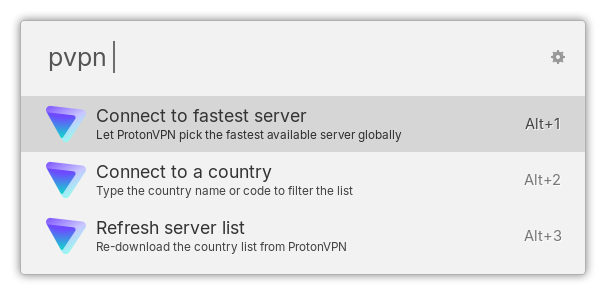

# Ulauncher ProtonVPN Extension

[](https://github.com/claudiosanches/ulauncher-protonvpn/actions/workflows/ci.yml)

An unofficial [Ulauncher](https://ulauncher.io/) extension to control
[ProtonVPN](https://protonvpn.com/) directly from your launcher.



> **Disclaimer:** This is an independent, community-made extension and is not
> affiliated with, endorsed by, or supported by Proton AG.

---

## Features

- Connect to the **fastest server globally** with a single keystroke
- **Browse countries** with flag icons and connect to the fastest server in any country
- **City-level drill-down** — pick a specific city within a country
- **Live connection status** — see the connected server, load, protocol, and your current IP right in the results
- **Disconnect** from any state
- **Refresh server list** to pull the latest country/city data from the CLI

---

## Requirements

- [Ulauncher](https://ulauncher.io/) 5+
- [ProtonVPN CLI](https://protonvpn.com/support/linux-vpn-setup/) (`protonvpn`) installed and signed in

Install and sign in to ProtonVPN CLI before using this extension:

```bash
# Install (Debian/Ubuntu example — see official docs for your distro)
sudo apt install protonvpn

# Sign in
protonvpn signin
```

---

## Installation

### Via Ulauncher UI (recommended)

1. Open Ulauncher preferences → **Extensions** → **Add extension**
2. Paste: `https://github.com/claudiosanches/ulauncher-protonvpn`
3. Click **Add**

### Manual

```bash
git clone https://github.com/claudiosanches/ulauncher-protonvpn \
  ~/.local/share/ulauncher/extensions/com.github.claudiosanches.ulauncher-protonvpn
```

Restart Ulauncher.

---

## Settings

| Setting         | Description                              | Default |
| --------------- | ---------------------------------------- | ------- |
| **Keyword**     | Trigger keyword in Ulauncher             | `pvpn`  |
| **Max results** | Maximum number of countries/cities shown | `10`    |

---

## Usage

| Input                                | Action                                                   |
| ------------------------------------ | -------------------------------------------------------- |
| `pvpn`                               | Show current connection status and quick actions         |
| `pvpn <query>`                       | Filter and browse countries (e.g. `pvpn us`, `pvpn ger`) |
| Select a country                     | Drill into the city list for that country                |
| Select a city                        | Connect to that specific city                            |
| Select **Fastest server in XX**      | Connect to the fastest server in the country             |
| Select **Connect to fastest server** | Connect to the globally fastest server                   |
| Select **Connect to a country**      | Browse the list of available countries                   |
| Select **Disconnect**                | Disconnect from ProtonVPN                                |
| Select **Refresh server list**       | Re-fetch available countries from the CLI                |

### Examples

```
pvpn              → show status / quick connect
pvpn us           → list US cities, connect to fastest or pick a city
pvpn ger          → find Germany, drill into cities
pvpn br           → find Brazil, connect to fastest or São Paulo, etc.
```

---

## How it works

This extension is a thin wrapper around the `protonvpn` CLI. All VPN
operations (connect, disconnect, status, country/city discovery) are
delegated directly to the CLI — no API keys, no credential storage, no
background daemons. Authentication is handled by `protonvpn signin`
separately.

The current public IP is captured from the `protonvpn connect` output
and cached in memory for the duration of the session.

---

## License

GPLv3 — see [LICENSE](LICENSE).

---

## Credits

- Flag icons: [circle-flags](https://github.com/HatScripts/circle-flags) by HatScripts (MIT)
- Proton VPN Icon: [homer-icons](https://github.com/NX211/homer-icons) by NX211
